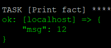
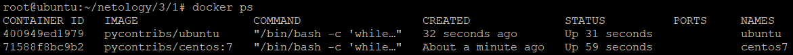
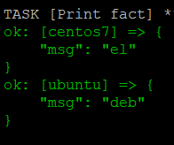
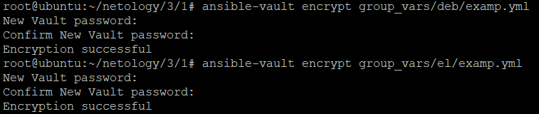
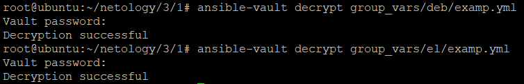

# 1. Введение в Ansible
## Основная часть:
1. Значение факта:  
     
2. Значение находится в [этом](./playbook/group_vars/all/examp.yml) файле.
3. Окружение создано:  
   
4. Полученные значения:  
   
5. Соответствующие файлы [deb](./playbook/group_vars/deb/examp.yml) и [el](./playbook/group_vars/el/examp.yml) изменены.
6. Вывод после модификации файлов:  
   
7. Файлы зашифрованы:  
   
8. Пароль был запрошен, playbook отрабатывает:  
   
9. Плагин ```local``` позволяет выполнять сценарии на ```control node```.
10. Файл [prod.yml](./playbook/inventory/prod.yml) изменен в соответствии с заданием.
11. Playbook успешно выполняется:  
    

## Необязательная часть:
1. Файлы расшифрованы:  
   
2. Строка ```PaSSw0rd``` зашифрована:  
     
   И с этой стракой создан [файл](./playbook/group_vars/all/exmp.yml) как указано в задании.
3. Playbook успешно отрабатывает:  
   
4. Новый хост добавлен в [inventory файл](./playbook/inventory/prod.yml) и создан новый [файл с переменными](./playbook/group_vars/fed/examp.yml).
5. [Скрипт](./my_script.sh) написан и успешно отрабатывает:  
     
   